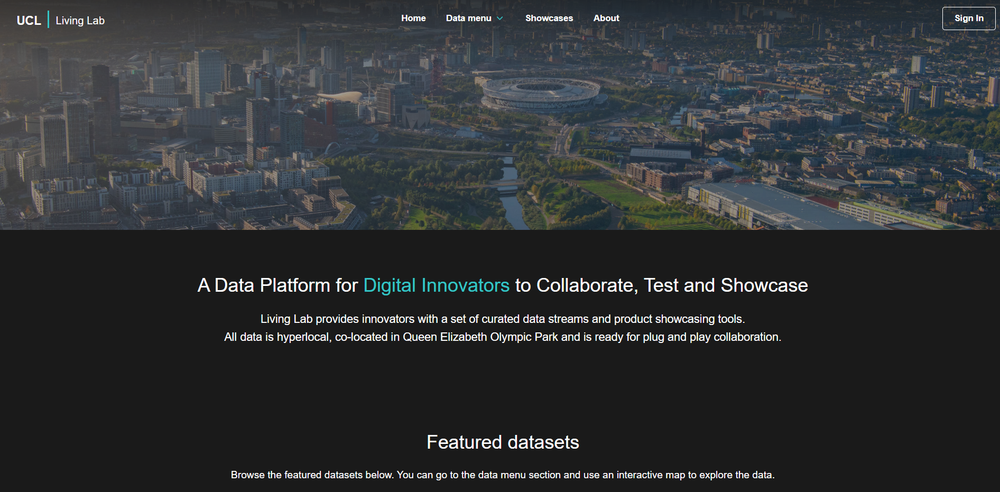
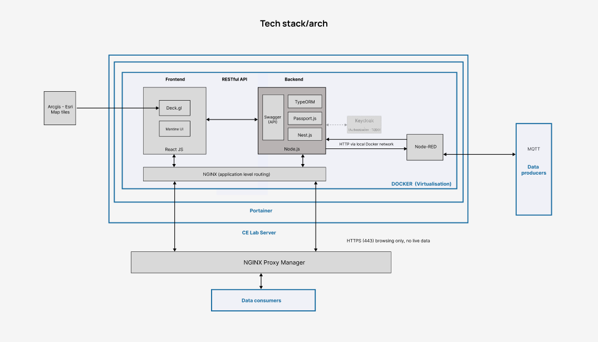

# Living Lab Documentation Overview

This repository contains comprehensive documentation and resources for the Living Lab platform.

---

## 📚 Content Guide

- **General video (covers manager and users)**
    - A comprehensive video tutorial about the Living Lab platform is available on project's Drive.

- **Platform manager**
    - [Admin responsibilities & approval process](docs/admin-responsibilities.md)
  
- **Platform design**
    - Conceptual diagram
    - Database
    - Personas
    - Architecture
    - Wireframes
    - Tech stack
    - Code structure
    - [Deployment notes](docs/deployment-notes.md)
    - Backlog (next version)
        - [Next version: Garnet & Wisdom layer](docs/next-version.md)
    - BOM (Bill of Materials)
    - Feedbacks and Presentations

---

## 📁 docs/ Folder Structure

- **Conceptual diagram**
  - [`conceptual-diagram-v2.jpg`](docs/conceptual-diagram/conceptual-diagram-v2.jpg)  
    
  - [`conceptual-diagram.drawio`](docs/conceptual-diagram/conceptual-diagram.drawio)  
    Editable source for conceptual diagrams.
  - `v2-versioning-plan/`  
    Contains versioning plans and related diagrams.

- **Database**
  - [`ER-Diagram-v6.png`](docs/database/ER-Diagram-v6.png)  
    Entity-relationship diagram for the platform database.

- **Personas**
  - [`personas/`](docs/personas/)  
    User personas and user journey documentation.

- **Architecture**
  - [`libraries-arch.drawio`](docs/libraries-arch.drawio)  
    Editable diagram file showing the libraries and architecture used in the project.

- **Wireframes**
  - [`wireframes/`](docs/wireframes/)  
    UI/UX wireframes and design assets.

- **Tech stack**
  - [`tech-stack/`](docs/tech-stack/)  
    Details and diagrams about the technology stack used.
  - [`tech-stack-v5.jpg`](docs/tech-stack/tech-stack-v5.jpg)  
    

- **Code structure**
  - See [`docs/code-structure.md`](docs/code-structure.md) for the detailed code structure documentation.

---

## 🎥 General Video

A comprehensive video tutorial about the Living Lab platform is available on project's Drive. The tutorial covers:

- Platform introduction and explanation of all features.
- How-to-use guides for both normal users and admins.
- Overview of admin responsibilities.
- User-oriented scenarios, including:
    - Demonstration of a normal user creating showcases and datasets.
    - How admins approve requests, with practical notes.
- Platform settings, user management, and statistics in the admin dashboard.

Please refer to the project's Drive for access to the video.

---

## 📄 Other Documentation

- **Permission Matrix:**  
  See [`PermissionMatrix.md`](docs/PermissionMatrix.md) for a detailed breakdown of user roles and access rights.

- **Admin Responsibilities & Approval Process:**  
  See [`admin-responsibilities.md`](docs/admin-responsibilities.md) for a comprehensive guide to admin tasks, approvals, and management features.

- **Personas & User Journeys:**  
  The [`personas/`](docs/personas/) folder contains documents describing typical users and their interactions with the platform.

- **Wireframes & UI Design:**  
  Explore [`wireframes/`](docs/wireframes/) for early-stage UI/UX designs.

---

## 📦 Bill of Materials (BOM)

For a full list of dependencies and build/runtime requirements, see:
- [Dockerfiles](./src/docker-compose.yml)
- [Backend package.json](./src/backend/package.json)
- [Frontend package.json](./src/frontend/package.json)

---

## 📢 Feedbacks and Presentations

Feedbacks and presentations are available in the shared Drive folder.  
- **Feedbacks**: Collected from the "Here and There" workshop at UCL, which had strong user engagement and valuable insights.
- **Presentations**: All major presentations and slides are also included in the Drive.

---

For more details on the codebase and how to contribute, see the [`src/README.md`](src/README.md) and [`src/frontend/README.md`](src/frontend/README.md).

---